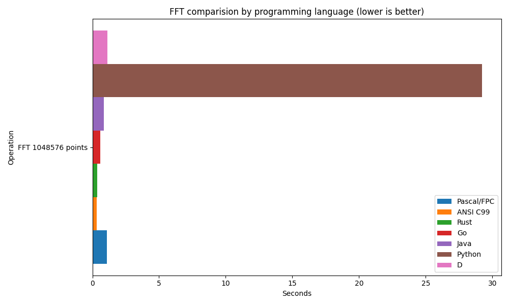

# FFT algo. perf. test in different programming langs.


## Bargraph with results




## Run log with results

```bash
$ cd pas/
$ fpc fft_perf.pas
$ time ./fft_perf 
Generating 1048576-point complex FFT input...
Technology: Pascal/FPC
FFT 1048576 points: 1.081739 seconds

real	0m1,221s
user	0m1,094s
sys	0m0,093s


$ cd c_99
$ gcc -O3 -std=c99 -o fft_perf fft_perf.c -lm
$ time ./fft_perf
Generating 1048576-point complex FFT input...
Technology: ANSI C99
FFT 1048576 points: 0.33590352 seconds

real	0m0,374s
user	0m0,306s
sys	0m0,068s


$ cd rust/
$ rustc -C opt-level=3 fft_perf.rs -o fft_perf
$ time ./fft_perf
Generating 1048576-point complex FFT input...
Technology: Rust (no libraries)
FFT 1048576 points: 0.343303 seconds

real	0m0,383s
user	0m0,310s
sys	0m0,073s


$ cd go/
$ go build -ldflags="-s -w" -o fft_perf fft_perf.go
$ time ./fft_perf
Generating 1048576-point complex FFT input...
Technology: Go
FFT 1048576 points: 0.590046 seconds

real	0m0,645s
user	0m0,527s
sys	0m0,132s


$ cd java/
$ javac java/FFTPerf.java
$ time java -Duser.language=en -Duser.region=US -cp java FFTPerf
Generating 1048576-point complex FFT input...
Technology: Java
FFT 1048576 points: 0.857245 seconds

real	0m1,167s
user	0m1,417s
sys	0m0,358s


$ cd py/
$ time python3 fft_perf.py
Generating 1048576-point complex FFT input...
Technology: Python
FFT 1048576 points: 29.214810 seconds

real	0m30,166s
user	0m29,712s
sys	0m0,453s


$ cd d/
$ dmd -O -release -inline fft_perf.d -of=fft_perf
$ time ./fft_perf 
Generating 1048576-point complex FFT input...
Technology: D
FFT 1048576 points: 1.13837100 seconds

real	0m1,199s
user	0m1,140s
sys	0m0,065s

```
