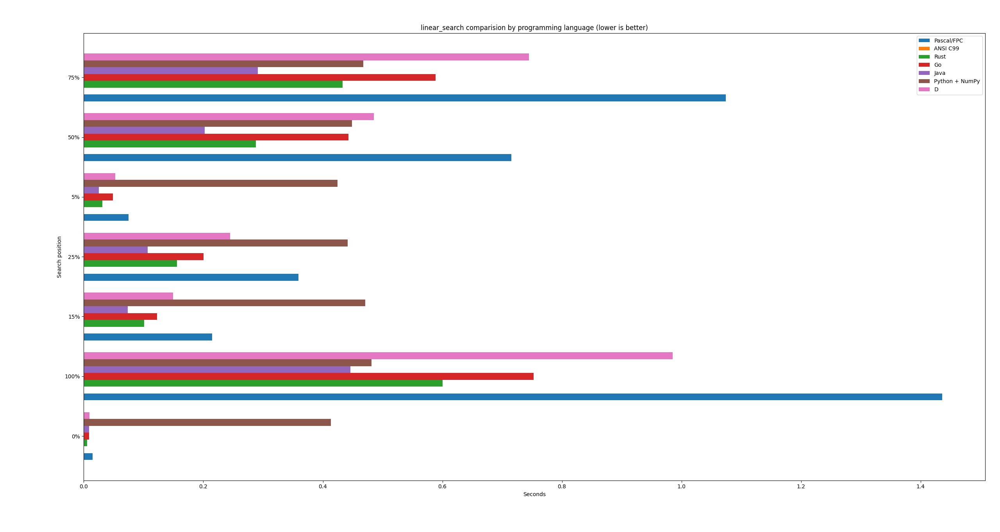

# linear search algo. perf. test in different programming langs.


## Bargraph with results (excluded Python, only Python + numpy - memory requirements reasons!)




## Run log with results

```bash
$ cd pas/
$ fpc LinearSearchPerf.pas
$ time ./LinearSearchPerf
Generating array of 1000000000 integers...and searching for values located at
Technology: Pascal/FPC
0%: 0.015 seconds
5%: 0.075 seconds
15%: 0.215 seconds
25%: 0.359 seconds
50%: 0.715 seconds
75%: 1.074 seconds
100%: 1.436 seconds

real	0m7,831s
user	0m6,525s
sys	0m1,304s


$ cd c/
$ gcc -std=c99 -O2 linear_search_perf.c -o linear_search_perf
$ time ./linear_search_perf
Generating array of 1000000000 integers... and searching for values located at
Technology: ANSI C99
0%: 0.00000100 seconds
5%: 0.00000100 seconds
15%: 0.00000100 seconds
25%: 0.00000000 seconds
50%: 0.00000100 seconds
75%: 0.00000000 seconds
100%: 0.00000100 seconds

real	0m1,918s
user	0m0,716s
sys	0m1,188s


$ cd rust
$ cargo run --release
   Compiling linear_search_perf v0.1.0 (/home/bieli/Pulpit/_prv/OpenSource/vector3-operations-langs-performance/programming-langs-performance-tests/linear_search/rust)
    Finished `release` profile [optimized] target(s) in 0.24s
     Running `target/release/linear_search_perf`
Generating array of 1000000000 integers... and searching for values located at
Technology: Rust
0%: 0.0053 seconds
5%: 0.0310 seconds
15%: 0.1010 seconds
25%: 0.1562 seconds
50%: 0.2882 seconds
75%: 0.4327 seconds
100%: 0.6006 seconds


$ cd go
$ go build -o linear_search_perf linear_search_perf.go
$ time ./linear_search_perf
Generating array of 1000000000 integers... and searching for values located at
Technology: Go
0%: 0.009075 seconds
5%: 0.048953 seconds
15%: 0.122605 seconds
25%: 0.200143 seconds
50%: 0.443009 seconds
75%: 0.588762 seconds
100%: 0.752470 seconds


$ cd java
$ javac java/LinearSearchPerf.java
$ time java -Duser.language=en -Duser.region=US -cp java  -Xmx12G LinearSearchPerf
Generating array of 1000000000 integers... and searching for values located at
Technology: Java
0%: 0.00860384 seconds
5%: 0.02534698 seconds
15%: 0.07325976 seconds
25%: 0.10675343 seconds
50%: 0.20258979 seconds
75%: 0.29131854 seconds
100%: 0.44618506 seconds

real	0m3,787s
user	0m2,124s
sys	0m1,703s


$ cd py
$ time python3 linear_search_perf.py 
Generating array of 1000000000 integers... and searching for values located at
Technology: Python
Killed

real	0m14,379s
user	0m4,875s
sys	0m8,852s


$ cd numpy/
$ time python3 main.py
Generating array of 1000000000 integers... and searching for values located at
Technology: Python + NumPy
0%: 0.413148 seconds
5%: 0.424473 seconds
15%: 0.470945 seconds
25%: 0.441766 seconds
50%: 0.448707 seconds
75%: 0.467565 seconds
100%: 0.481252 seconds

real	0m4,007s
user	0m3,685s
sys	0m1,388s


$ cd d/
$ dmd linear_search_perf.d -O -release -inline -of=linear_search_perf
$ time ./linear_search_perf 
Generating array of 1000000000 integers... and searching for values located at
Technology: D
0%: 0.00946380 seconds
5%: 0.05263750 seconds
15%: 0.14914100 seconds
25%: 0.24496760 seconds
50%: 0.48557960 seconds
75%: 0.74502750 seconds
100%: 0.98531650 seconds

real	0m6,856s
user	0m4,183s
sys	0m2,671s
```
