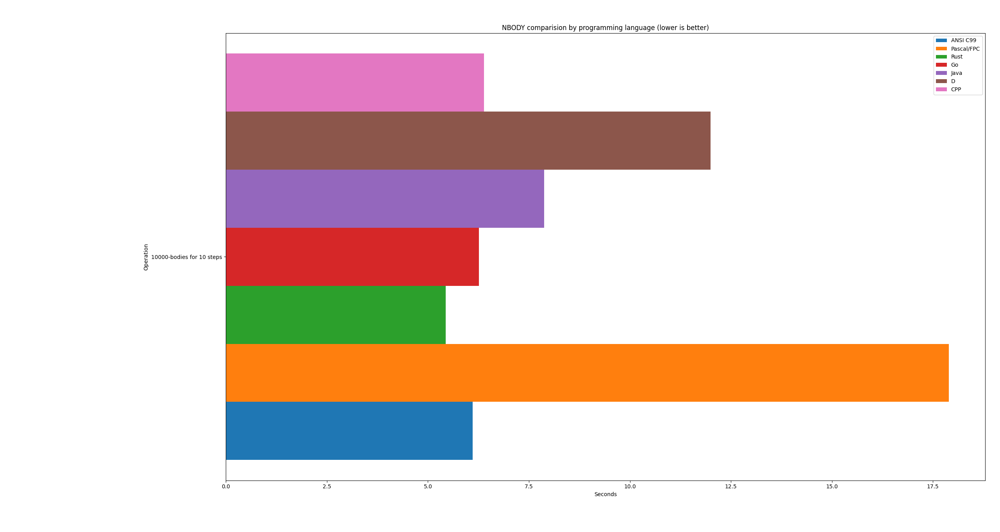

# N-body simulations perf. test in different programming langs.


## Bargraph with results




## Run log with results

```bash
$ cd c/
$ gcc -O3 -std=c99 -o nbody_perf nbody_perf.c -lm
$ time ./nbody_perf
Running N-body simulation with 10000 bodies for 10 steps...
Technology: ANSI C99
10000-bodies for 10 steps: 6.107018 seconds

real	0m6,114s
user	0m6,100s
sys	0m0,004s


$ cd pas/
$ fpc nbody_perf.pas 
Free Pascal Compiler version 3.0.4+dfsg-23 [2019/11/25] for x86_64
Copyright (c) 1993-2017 by Florian Klaempfl and others
Target OS: Linux for x86-64
Compiling nbody_perf.pas
nbody_perf.pas(86,3) Note: Local variable "i" not used
Linking nbody_perf
/usr/bin/ld.bfd: warning: link.res contains output sections; did you forget -T?
100 lines compiled, 0.3 sec
1 note(s) issued
$ time ./nbody_perf 
Running N-body simulation with 10000 bodies for 10 steps...
Technology: Pascal/FPC
10000-bodies for 10 steps: 17.894377 seconds

real	0m17,901s
user	0m17,887s
sys	0m0,004s


$ cd rust/
$ time cargo run --release
Running N-body simulation with 10000 bodies for 10 steps...
Technology: Rust
10000-bodies for 10 steps: 5.439217 seconds

real	0m5,748s
user	0m5,696s
sys	0m0,062s


$ cd go/
$ go build -ldflags="-s -w" -o nbody_perf nbody_perf.go
$ time ./nbody_perf 
Running N-body simulation with 10000 bodies for 10 steps...
Technology: Go
10000-bodies for 10 steps: 6.261198 seconds

real	0m6,270s
user	0m6,266s
sys	0m0,016s


$ cd java/
$ javac java/NBodyPerf.java
$ time java -Duser.language=en -Duser.region=US -cp java NBodyPerf
Running N-body simulation with 10000 bodies for 10 steps...
Technology: Java
10000-bodies for 10 steps: 7.873479 seconds

real	0m8,104s
user	0m8,109s
sys	0m0,033s


$ cd d/
$ dmd -O -release -inline nbody_perf.d -of=nbody_perf
$ time ./nbody_perf 
Running N-body simulation with 10000 bodies for 10 steps...
Technology: D
10000-bodies for 10 steps: 12 seconds

real	0m12,924s
user	0m12,923s
sys	0m0,000s


$ cd cpp/
$ g++ -O3 -std=c++11 -o nbody_perf nbody_perf.cpp
$ time ./nbody_perf 
Running N-body simulation with 10000 bodies for 10 steps...
Technology: CPP
10000-bodies for 10 steps: 6.387668 seconds

real	0m6,396s
user	0m6,384s
sys	0m0,012s


```

