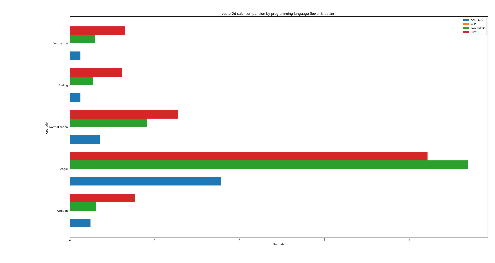

# Vector2D calc. perf. test in different programming langs.


## Bargraph with results




## Run log with results

```bash
Technology: ANSI C99
Addition: 0.24280200 seconds
Subtraction: 0.12538200 seconds
Scaling: 0.12349200 seconds
Normalization: 0.35481300 seconds
Angle: 1.78305500 seconds


$ cd cpp/
$ g++ -O3 -std=c++17 main.cpp -o vector2d_bench
$ time ./vector2d_bench 
Technology: CPP
Addition: 0.0000004 seconds
Subtraction: 0.0000001 seconds
Scaling: 0.0000001 seconds
Normalization: 0.0000001 seconds
Angle: 0.0000001 seconds

real	0m0,007s
user	0m0,003s
sys	0m0,004s


Technology: Pascal/FPC
Addition: 0.311 seconds
Subtraction: 0.294 seconds
Scaling: 0.269 seconds
Normalization: 0.914 seconds
Angle: 4.689 seconds


$ cd rust/
$ rustc main.rs
$ time ./main 
Technology: Rust
Addition: 0.76799014 seconds
Subtraction: 0.64620785 seconds
Scaling: 0.61320496 seconds
Normalization: 1.27767814 seconds
Angle: 4.21457086 seconds

real	0m7,524s
user	0m7,514s
sys	0m0,004s


```
