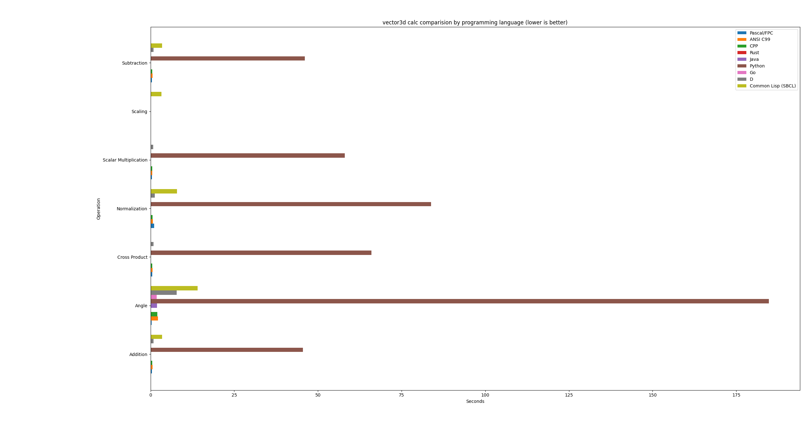
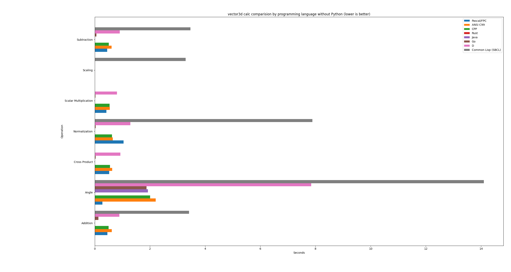

# vector3 calc. tests for programming langs.

## Bendchmarks results as bar graphs






## Example outputs from vector3 opeartions perf. tests (running the same machine)
```bash
$ make pas/TestVectorsPerf
Technology: Pascal/FPC
Addition: 0.4600 seconds
Subtraction: 0.4520 seconds
Cross Product: 0.5200 seconds
Scalar Multiplication: 0.4250 seconds
Normalization: 1.0410 seconds
Angle: 0.2740 seconds

$ make c/test_vector_perf
Technology: ANSI C99
Addition: 0.6209 seconds
Subtraction: 0.6097 seconds
Cross Product: 0.6331 seconds
Scalar Multiplication: 0.5431 seconds
Normalization: 0.6557 seconds
Angle: 2.2121 seconds

$ make cpp/vector_perf
Technology: CPP
Addition: 0.50293 seconds
Subtraction: 0.507009 seconds
Cross Product: 0.550719 seconds
Scalar Multiplication: 0.53738 seconds
Normalization: 0.626334 seconds
Angle: 2.01002 seconds

$ make rust/target/release/vector_perf
Technology: Rust
Addition: 0.0000000970 seconds
Subtraction: 0.0000000440 seconds
Cross Product: 0.0000000430 seconds
Scalar Multiplication: 0.0000000440 seconds
Normalization: 0.0000000450 seconds
Angle: 0.0000050340 seconds

$ make java/VectorPerfTest 
Technology: Java
Addition: 0.004546 seconds
Subtraction: 0.004667 seconds
Cross Product: 0.004553 seconds
Scalar Multiplication: 0.006037 seconds
Normalization: 0.003731 seconds
Angle: 1.926428 seconds

$ make py/test_vectors_perf
Technology: Python
Addition: 45.5106 seconds
Subtraction: 46.0557 seconds
Cross Product: 65.9770 seconds
Scalar Multiplication: 58.0498 seconds
Normalization: 83.8463 seconds
Angle: 184.7451 seconds

$ make go/main
Technology: Go
Addition: 0.132510 seconds
Subtraction: 0.059451 seconds
Cross Product: 0.029388 seconds
Scalar Multiplication: 0.025097 seconds
Normalization: 0.028984 seconds
Angle: 1.879684 seconds

$ make d/vector3d_perf
Technology: D
Addition: 0.89552490 seconds
Subtraction: 0.90387880 seconds
Cross Product: 0.93123390 seconds
Scalar Multiplication: 0.80616550 seconds
Normalization: 1.29011100 seconds
Angle: 7.84480880 seconds

$ cd lisp/
$ sudo apt install sbcl
$ time sbcl --script main.lisp
Technology: Common Lisp (SBCL)
Addition: 3.41600000 seconds
Subtraction: 3.46500000 seconds
Scaling: 3.29200000 seconds
Normalization: 7.88500000 seconds
Angle: 14.10300000 seconds

real	0m32,243s
user	0m32,150s
sys	0m0,088s

```

